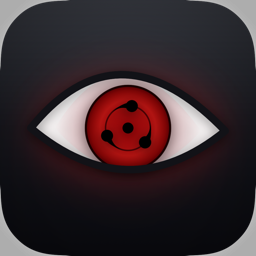
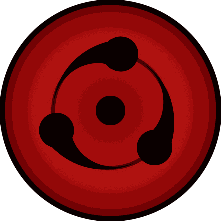
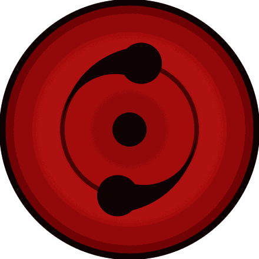
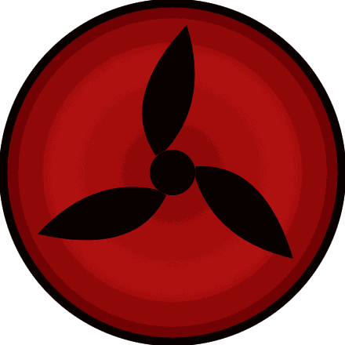
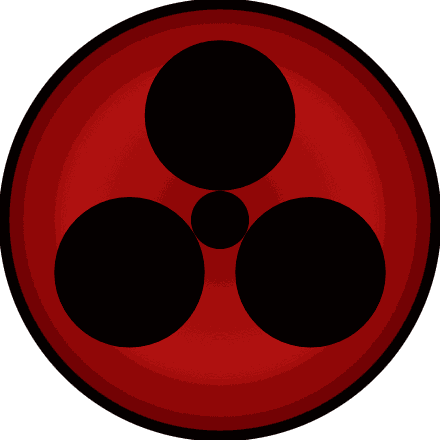
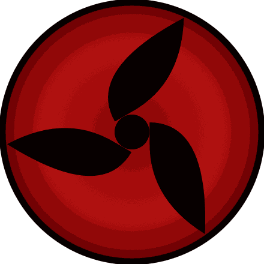
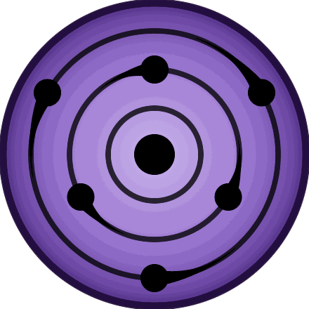

<p align="center">
  
</p>

<h1 align="center">Sharingan</h1>

<p align="center"><b>Pomodoro &amp; eye-health for macOS</b><br>
A menu-bar Pomodoro timer, a full task manager, and guided eye exercises — in one liquid-glass app.</p>

<p align="center">
  <a href="https://github.com/bakhod1r/sharingan/releases/latest"></a>
  
  
  <a href="LICENSE"></a>
</p>

<p align="center">
  <a href="https://bakhod1r.github.io/Blink/"><b>Website</b></a> ·
  <a href="https://github.com/bakhod1r/sharingan/releases/latest"><b>Download</b></a> ·
  <a href="CHANGELOG.md"><b>Changelog</b></a>
</p>

<p align="center">
  
  
  
  
  
  
  <br><sub>18 Sharingan iris styles, rendered by the app itself</sub>
</p>

---

Sharingan protects your eyes while you work: focus in Pomodoro blocks, then the
screen locks for a real break with guided eye drills — optionally verified by
the camera. A complete task system with natural-language input (English +
Uzbek) keeps the work itself organized.

> Formerly known as **Blink** — you may still see the old name in the site URL
> and history. Pure SwiftPM — no Xcode project required.

## Install

**Download** — grab `Sharingan.dmg` from the
[latest release](https://github.com/bakhod1r/sharingan/releases/latest) and drag
the app into Applications.

Builds are not notarized yet: on first launch, right-click the app →
**Open** (or run `xattr -cr /Applications/Sharingan.app`).

**Build from source** — requires macOS 14+ and Xcode command-line tools:

```bash
git clone https://github.com/bakhod1r/sharingan.git && cd sharingan
Scripts/install.sh          # build dist/Sharingan.app and install to /Applications
Scripts/install-cli.sh      # optional: put the `tired` CLI on your PATH
```

## Features

**Timer / Pomodoro**
- Three gears — Small `10′+3′`, Normal `25′+5′`, Big `90′+15′` (each editable),
  countdown or count-up, auto-cycle, long breaks every N pomodoros, `±5m` on
  the fly.
- Natural-language time input (`5 min`, `2h 30m`, `5pm`, `+5m`), sleep-aware
  tracking, and a custom one-off session length.

**Tasks & planning**
- Full task system: title, priority, tags, projects, categories, due dates,
  notes, estimates, subtasks (each with its own priority/estimate), recurrence,
  and templates.
- Natural-language quick add in the **world's 25 most-spoken languages** at
  once — e.g. `ertaga 15:00 p1 #ish ~2 hisobot yozish` — with live parse chips
  as you type.
- Bulk import from Markdown or JSON (paste, drag a file, or drop into any
  add-a-task field), with duplicate detection.
- Smart views (Today, Upcoming, All, Completed), free-text search, sort/filter
  menus shared across every surface, and CSV export.
- **Focus queue** that advances task by task, an **Eisenhower matrix**,
  a **weekly board**, and a floating desktop **Today panel**.

**Breaks & eye health**
- Full-screen, multi-monitor break overlay at screen-saver level; ⌘Q/⌘W/⌘Tab
  are blocked until the break ends (skippable if you allow it).
- 20-20-20, 8-direction gaze, and blink drills with animated guides and voice
  guidance (TTS).
- Optional **camera verification** of blinks and gaze via Vision, with a
  privacy indicator.
- Ambience sounds (white noise, rain, forest, lo-fi), smooth screen dim,
  optional Night Shift warmth, and posture/water/custom reminders.

**Sharingan eyes & visuals**
- 18 iris styles — classic tomoe through Mangekyō to Rinnegan — all rendered
  as vector art, evolving as you use the app.
- Animated eyes on the break screen and an optional live desktop wallpaper
  that follows the cursor.

**Six surfaces**
- Menu-bar popover, main window, notch HUD with live "ears", a draggable
  floating pill timer, a desktop WidgetKit widget, and the glass Today panel.

**Stats, streaks & rewards**
- Daily/weekly/monthly focus history and charts, consecutive-day streaks with
  milestone badges (1→365 days), per-task and per-project focus logs, and a
  configurable daily pomodoro goal.

**Themes & interface**
- Six themes — Liquid Glass, Frosted, Midnight, Cream, Neon, Mono — with
  searchable settings and a global menu bar.

**Focus enforcement & integrations**
- Hide or force-quit distracting apps during focus/breaks (Chrome, Slack,
  Telegram… presets included), automatic Do Not Disturb, rebindable global
  hotkeys, the `sharingan://` URL scheme for Shortcuts/Raycast, and the
  `tired` CLI.

iCloud sync is planned but **not shipped yet** — everything is local today.

## `tired` — control it from the terminal

```bash
tired start 25            # 25-minute focus
tired start 5pm           # focus until 5:00 PM
tired pause / resume      # pause & resume
tired skip / reset        # next phase / stop
tired add 5m              # +5 minutes
tired status              # current state
tired task add "ertaga p1 #ish hisobot"   # NL quick add
tired task list           # numbered open tasks
tired task start 3        # make task #3 active
tired task queue 3        # queue task #3 for focus
```

The CLI talks to the running app via Darwin notifications + a `UserDefaults`
snapshot — no XPC required.

## Development

```bash
make build          # debug build of all targets
make run            # launch the menu-bar app from source
make test           # swift-testing suites (plus: swift run SelfTest)
make app            # assemble dist/Sharingan.app (icon, widget appex, codesign)
make dmg            # wrap it into dist/Sharingan.dmg
make open           # build the .app and launch it
```

```
Package.swift
Sources/
  SharinganCore/       # testable logic — models + services (timer, tasks, streaks, eye tracking)
  Sharingan/           # SwiftUI/AppKit executable (the .app)
  SharinganWidget/     # WidgetKit desktop widget (built into the appex by make-app.sh)
  tired/               # `tired` CLI executable
  SelfTest/            # standalone assertion harness
Tests/                 # swift-testing suites
Resources/             # Info.plist, entitlements, AppIcon, sounds
Scripts/               # make-app.sh, make-dmg.sh, install.sh
site/                  # marketing site (GitHub Pages)
```

Releases are automated: pushing a `v*` tag builds the DMG on a macOS runner
and attaches it to the GitHub release, with notes taken from the changelog.

**Tech stack** — Swift 5.9+, SwiftUI + AppKit, WidgetKit, Vision (face/eye
landmarks), AVFoundation (camera, TTS, audio), SwiftCharts, Carbon global
hotkeys. Pure SwiftPM.

## Contact


Bakhodir Yashin Mansur — bakhodiryashinmansur@gmail.com

## License

[MIT](LICENSE) © 2026 Bakhodir Yashin Mansur
